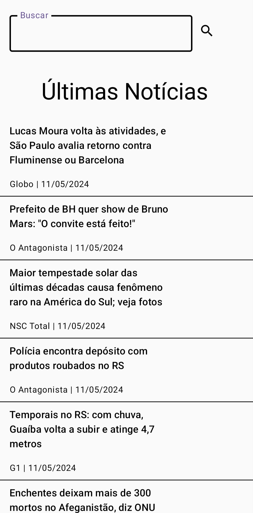

# News-App
# News-App

A simple app that displays the latest news from Brazil or from a user search.
It consumes the [News Api](https://newsapi.org/)).
The technologies and tools used are: Android, Kotlin, Jetpack Compose, Navigation, Koin, Clip.

# Screens

